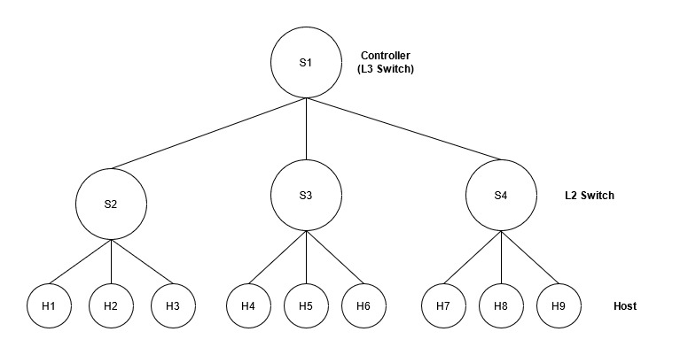

# DDoS mitigation using SDN

## Setup

### Set files up
```bash
python -m pip install -r requirements.txt
cp ./ddos.py ~/pox/ext
cp ./traffic.py ~/
cd ~/
```

### **[OPTIONAL]** To enable X11 forwarding on Windows
1. Install Putty
2. Install [VcXsrv Windows X Server](https://sourceforge.net/projects/vcxsrv/)
3. Run XLaunch, don't change any settings and launch the X server
4. Launch Putty and put in your Mininet VM details
5. Before connecting, head over to the SSH settings in the left tree and enable
   X11 forwarding

## Network Topology



## Testing Methodology

### Simulating a Denial-of-Service attack
1. Spawn a terminal and run `sudo -E mn --switch ovs --topo tree,depth=2,fanout=3 --controller=remote,ip=127.0.0.1,port=6633`
2. It creates a network topology using Open vSwitches with depth two and 3 children at every node
3. The -E flag preserves host environment variables from being overwritten
4. Spawn a second terminal and run `cd pox` and then `./pox.py forwarding.l3_learning`
5. In the first terminal shell, where the Mininet CLI is running, run `xterm h1 h3 h7`
6. Our goal is to render the controller or our L3 switch S1 useless
7. On H4's shell, run `python ./traffic.py flood 1`
8. This will cause a SYN flood on H1, these packets will exhaust the controller
   and bring the network down
9. To test if this is working, the following test cases should pass on host H7:
   1. `ping 10.0.0.1` should **fail**, since controller is under attack
   2. `ping 10.0.0.5` should **fail**, since controller is under attack

### Mitigating a Denial-of-Service attack
1. Spawn a terminal and run `sudo -E mn --switch ovs --topo tree,depth=2,fanout=3 --controller=remote,ip=127.0.0.1,port=6633`
2. Spawn a second terminal and run `cd pox && ./pox.py forwarding.l3_learning ddos`
3. In the first terminal shell, where the Mininet CLI is running, run `xterm h1 h3 h7`
4. Our goal is to prevent the DoS from rendering the controller or our L3 switch S1 useless
5. On H4's shell, run `python ./traffic.py flood 1`
6. This will cause a SYN flood on H1, and should be detected by our controller
   and block H4 or 10.0.0.4
7. To test if this is working, the following test cases should pass on host H7:
   1. `ping 10.0.0.1` should **pass**, since H4 is blocked from sending packets
8. The following test cases should pass on host H4:
   1. `ping 10.0.0.1` should **fail**, since H4 is blocked from sending packets